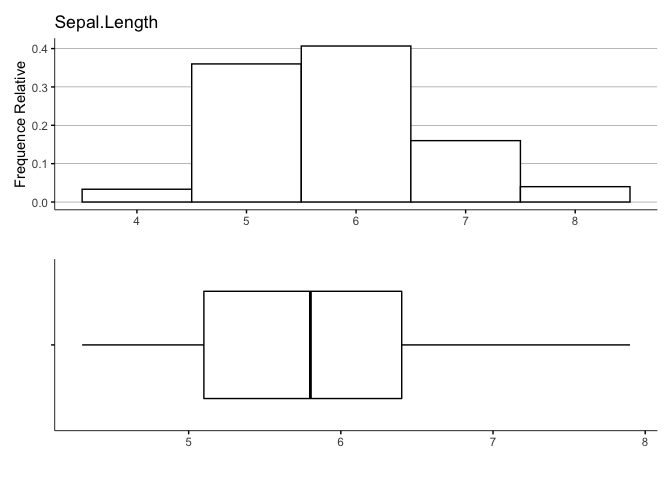
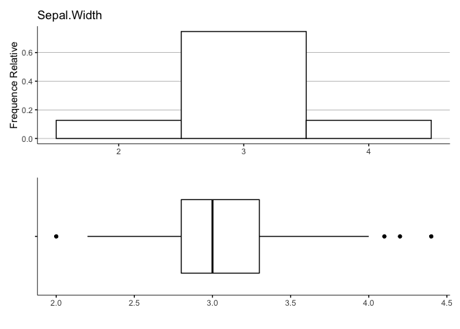
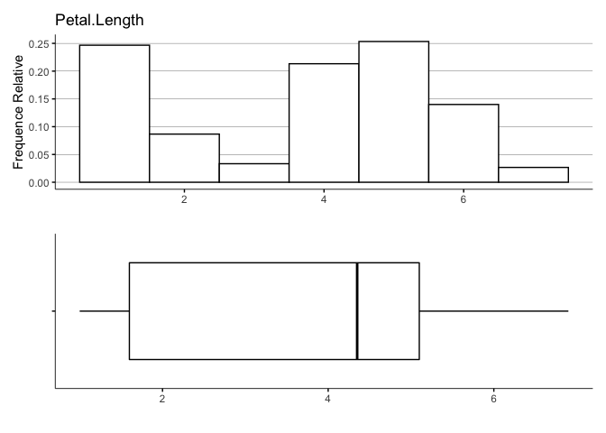
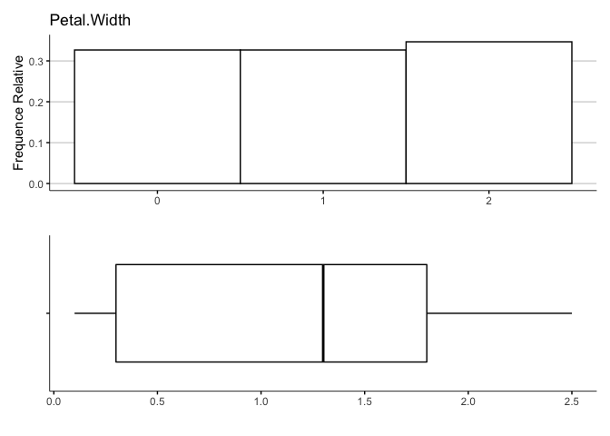
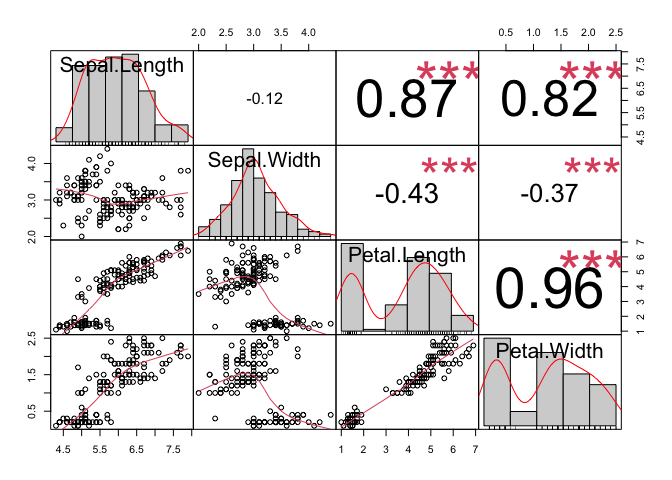
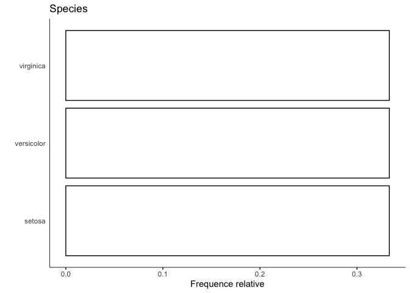
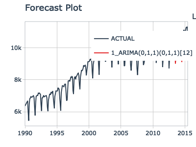

<!-- README.md is generated from README.Rmd. Please edit that file -->

# jofou.lib

<!-- badges: start -->
<!-- badges: end -->

The goal of `jofou.lib` is to regroup all the functions that are useful
for me to work efficiently.

## Installation

You can install the lastest version of jofou.lib with:

``` r
devtools::install_github("jofou/jofou.lib")
```

# EDA Functions

## Example

This are basics examples which shows you how use the my\_inspect group
function:

``` r
library(tidyverse)
library(jofou.lib)

iris %>% 
  my_inspect_cat()
```

<table class="table table-condensed" style="width: auto !important; ">
<caption>
Resume et comparaison des variables categoriques
</caption>
<thead>
<tr>
<th style="text-align:left;">
Nom de la variable
</th>
<th style="text-align:right;">
Nombre
</th>
<th style="text-align:left;">
Commun
</th>
<th style="text-align:right;">
pourcentage
</th>
</tr>
</thead>
<tbody>
<tr>
<td style="text-align:left;">
Species
</td>
<td style="text-align:right;">
3
</td>
<td style="text-align:left;">
setosa
</td>
<td style="text-align:right;">
33
</td>
</tr>
</tbody>
</table>

``` r
library(tidyverse)
library(jofou.lib)

iris %>% 
  my_inspect_cor()
```

<table class="table table-condensed" style="width: auto !important; ">
<caption>
Coeficient de correlation pour toutes les variables numeriques
</caption>
<thead>
<tr>
<th style="text-align:left;">
Variable 1
</th>
<th style="text-align:left;">
Variable 2
</th>
<th style="text-align:right;">
Correlation
</th>
<th style="text-align:right;">
Valeur P
</th>
<th style="text-align:right;">
N-NA (%)
</th>
</tr>
</thead>
<tbody>
<tr>
<td style="text-align:left;">
Petal.Width
</td>
<td style="text-align:left;">
Petal.Length
</td>
<td style="text-align:right;">
0.96
</td>
<td style="text-align:right;">
0.000
</td>
<td style="text-align:right;">
100
</td>
</tr>
<tr>
<td style="text-align:left;">
Petal.Length
</td>
<td style="text-align:left;">
Sepal.Length
</td>
<td style="text-align:right;">
0.87
</td>
<td style="text-align:right;">
0.000
</td>
<td style="text-align:right;">
100
</td>
</tr>
<tr>
<td style="text-align:left;">
Petal.Width
</td>
<td style="text-align:left;">
Sepal.Length
</td>
<td style="text-align:right;">
0.82
</td>
<td style="text-align:right;">
0.000
</td>
<td style="text-align:right;">
100
</td>
</tr>
<tr>
<td style="text-align:left;">
Petal.Length
</td>
<td style="text-align:left;">
Sepal.Width
</td>
<td style="text-align:right;">
-0.43
</td>
<td style="text-align:right;">
0.000
</td>
<td style="text-align:right;">
100
</td>
</tr>
<tr>
<td style="text-align:left;">
Petal.Width
</td>
<td style="text-align:left;">
Sepal.Width
</td>
<td style="text-align:right;">
-0.37
</td>
<td style="text-align:right;">
0.000
</td>
<td style="text-align:right;">
100
</td>
</tr>
<tr>
<td style="text-align:left;">
Sepal.Width
</td>
<td style="text-align:left;">
Sepal.Length
</td>
<td style="text-align:right;">
-0.12
</td>
<td style="text-align:right;">
0.154
</td>
<td style="text-align:right;">
100
</td>
</tr>
</tbody>
</table>

``` r
library(tidyverse)
library(jofou.lib)

iris %>% 
  my_inspect_imb()
```

<table class="table table-striped table-condensed" style="width: auto !important; ">
<caption>
Resume des categories les plus utilisees
</caption>
<thead>
<tr>
<th style="text-align:left;">
Nom de la variable
</th>
<th style="text-align:left;">
Categorie
</th>
<th style="text-align:right;">
Pourcentage
</th>
<th style="text-align:right;">
Nombre
</th>
</tr>
</thead>
<tbody>
<tr>
<td style="text-align:left;">
Species
</td>
<td style="text-align:left;">
setosa
</td>
<td style="text-align:right;">
33
</td>
<td style="text-align:right;">
50
</td>
</tr>
</tbody>
</table>

``` r
library(tidyverse)
library(jofou.lib)

iris %>% 
  my_inspect_na()
```

<table class="table table-condensed" style="width: auto !important; ">
<caption>
Nombre de valeur manquante pour chaque variable
</caption>
<thead>
<tr>
<th style="text-align:left;">
Nom de la variable
</th>
<th style="text-align:right;">
NA
</th>
<th style="text-align:right;">
Pourcentage
</th>
</tr>
</thead>
<tbody>
<tr>
<td style="text-align:left;">
Sepal.Length
</td>
<td style="text-align:right;">
0
</td>
<td style="text-align:right;">
0
</td>
</tr>
<tr>
<td style="text-align:left;">
Sepal.Width
</td>
<td style="text-align:right;">
0
</td>
<td style="text-align:right;">
0
</td>
</tr>
<tr>
<td style="text-align:left;">
Petal.Length
</td>
<td style="text-align:right;">
0
</td>
<td style="text-align:right;">
0
</td>
</tr>
<tr>
<td style="text-align:left;">
Petal.Width
</td>
<td style="text-align:right;">
0
</td>
<td style="text-align:right;">
0
</td>
</tr>
<tr>
<td style="text-align:left;">
Species
</td>
<td style="text-align:right;">
0
</td>
<td style="text-align:right;">
0
</td>
</tr>
</tbody>
</table>

``` r
library(tidyverse)
library(jofou.lib)

iris %>% 
  my_inspect_num()
```

<table class="table table-condensed" style="width: auto !important; ">
<caption>
Resume et comparaison des variables numeriques
</caption>
<thead>
<tr>
<th style="text-align:left;">
Nom de la variable
</th>
<th style="text-align:right;">
min
</th>
<th style="text-align:right;">
q1
</th>
<th style="text-align:right;">
median
</th>
<th style="text-align:right;">
moyenne
</th>
<th style="text-align:right;">
q3
</th>
<th style="text-align:right;">
max
</th>
<th style="text-align:right;">
sd
</th>
<th style="text-align:right;">
NA (%)
</th>
</tr>
</thead>
<tbody>
<tr>
<td style="text-align:left;">
Sepal.Length
</td>
<td style="text-align:right;">
4
</td>
<td style="text-align:right;">
5
</td>
<td style="text-align:right;">
6
</td>
<td style="text-align:right;">
6
</td>
<td style="text-align:right;">
6
</td>
<td style="text-align:right;">
8
</td>
<td style="text-align:right;">
1
</td>
<td style="text-align:right;">
0
</td>
</tr>
<tr>
<td style="text-align:left;">
Sepal.Width
</td>
<td style="text-align:right;">
2
</td>
<td style="text-align:right;">
3
</td>
<td style="text-align:right;">
3
</td>
<td style="text-align:right;">
3
</td>
<td style="text-align:right;">
3
</td>
<td style="text-align:right;">
4
</td>
<td style="text-align:right;">
0
</td>
<td style="text-align:right;">
0
</td>
</tr>
<tr>
<td style="text-align:left;">
Petal.Length
</td>
<td style="text-align:right;">
1
</td>
<td style="text-align:right;">
2
</td>
<td style="text-align:right;">
4
</td>
<td style="text-align:right;">
4
</td>
<td style="text-align:right;">
5
</td>
<td style="text-align:right;">
7
</td>
<td style="text-align:right;">
2
</td>
<td style="text-align:right;">
0
</td>
</tr>
<tr>
<td style="text-align:left;">
Petal.Width
</td>
<td style="text-align:right;">
0
</td>
<td style="text-align:right;">
0
</td>
<td style="text-align:right;">
1
</td>
<td style="text-align:right;">
1
</td>
<td style="text-align:right;">
2
</td>
<td style="text-align:right;">
2
</td>
<td style="text-align:right;">
1
</td>
<td style="text-align:right;">
0
</td>
</tr>
</tbody>
</table>

``` r
library(tidyverse)
library(jofou.lib)

iris %>% 
  my_inspect_types()
```

<table class="table table-condensed" style="width: auto !important; ">
<caption>
Types de variables disponibles
</caption>
<thead>
<tr>
<th style="text-align:left;">
Type
</th>
<th style="text-align:right;">
Nombre
</th>
<th style="text-align:right;">
Pourcentage
</th>
<th style="text-align:left;">
Nom des variables
</th>
</tr>
</thead>
<tbody>
<tr>
<td style="text-align:left;">
numeric
</td>
<td style="text-align:right;">
4
</td>
<td style="text-align:right;">
80
</td>
<td style="text-align:left;">
Sepal.Length, Sepal.Width , Petal.Length, Petal.Width
</td>
</tr>
<tr>
<td style="text-align:left;">
factor
</td>
<td style="text-align:right;">
1
</td>
<td style="text-align:right;">
20
</td>
<td style="text-align:left;">
Species
</td>
</tr>
</tbody>
</table>

I also have a couples of other functions to show distributions of
numeric and categorical variables:

``` r
library(tidyverse)
library(jofou.lib)

iris %>% 
  my_num_dist()
```



``` r
library(tidyverse)
library(jofou.lib)

iris %>% 
  my_corr_num_graph()
```



    #> NULL

``` r
library(tidyverse)
library(jofou.lib)

iris %>% 
  my_cat_dist()
```



# Utilities Functions

## Example

These are basic examples that show you how to use my utilities
functions:

``` r
library(tidyverse)
library(jofou.lib)

iris %>%
  mutate(cat_Sepal.Length=round(Sepal.Length, digits = 0)) %>%
  group_by(cat_Sepal.Length) %>%
  summarise(mode_species=calculate_mode(Species))
#> # A tibble: 5 x 2
#>   cat_Sepal.Length mode_species
#> *            <dbl> <fct>       
#> 1                4 setosa      
#> 2                5 setosa      
#> 3                6 versicolor  
#> 4                7 virginica   
#> 5                8 virginica
```

``` r
library(tidyverse)
library(jofou.lib)

iris %>%
  filter(Species %ni% "setosa") %>%
  group_by(Species) %>%
  summarise(nb=dplyr::n())
#> # A tibble: 2 x 2
#>   Species       nb
#> * <fct>      <int>
#> 1 versicolor    50
#> 2 virginica     50
```

# ML Functions

## Example

These are basic examples that show you how to use my machine learning
utilities functions:

``` r
library(tidyverse)
library(lubridate)
library(timetk)
library(parsnip)
library(rsample)
library(modeltime)

# Data
data_prepared_tbl <- m4_monthly %>% filter(id == "M750")

# Split Data 80/20
splits <- initial_time_split(data_prepared_tbl, prop = 0.9)

# Model: auto_arima
model_fit_arima <- arima_reg() %>%
   set_engine(engine = "auto_arima") %>%
   fit(value ~ date, data = training(splits))

# Calibrate and plot
calibrate_and_plot(model_fit_arima, type="testing")
#> # A tibble: 1 x 9
#>   .model_id .model_desc             .type   mae  mape  mase smape  rmse   rsq
#>       <int> <chr>                   <chr> <dbl> <dbl> <dbl> <dbl> <dbl> <dbl>
#> 1         1 ARIMA(0,1,1)(0,1,1)[12] Test   151.  1.41 0.516  1.43  198. 0.930
```


